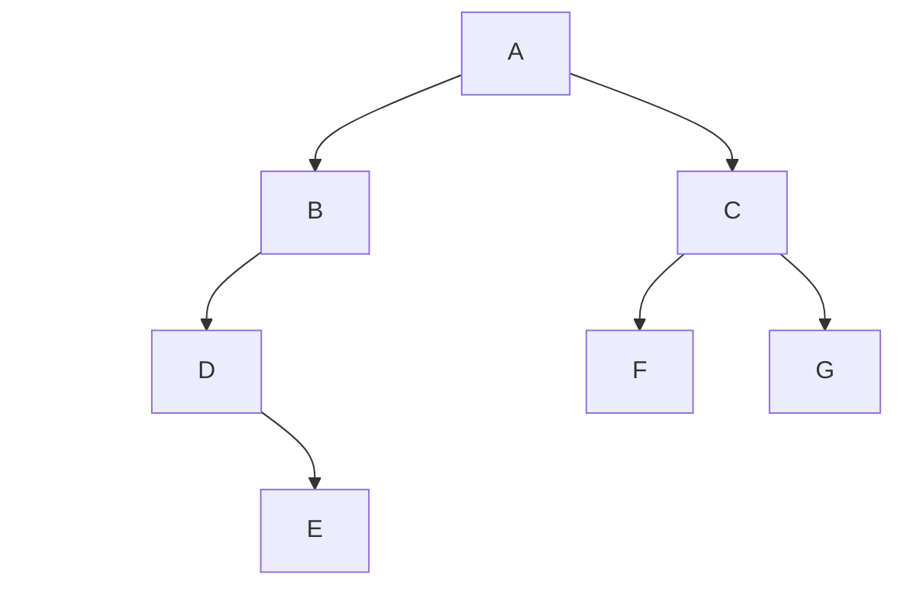
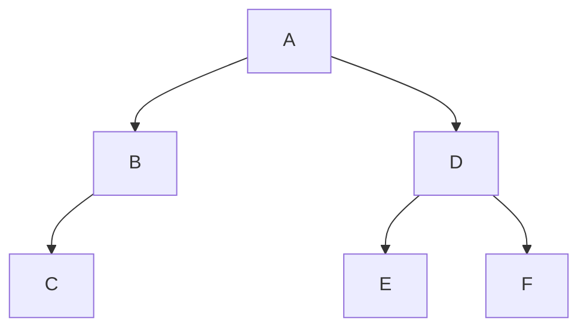

一、某二叉树中序序列为D,E,B,A,F,C,G,后序序列为E,D,B,F,G,C,A
1. 画出该二叉树；
2. 该二叉树的先序遍历序列。

二叉树如图所示。

先序遍历序列为A,B,D,E,C,F,G。

后序序列的规则为“**左->右->根**”，因此最后一个元素A即为整棵树的根，再看中序序列，其规则为“**左->根->右**”，因此以A为分界，左侧元素构成左子树，右侧元素构成右子树；先看“B、D、E”的部分，同理得B为左子树的根，而左子树的中序序列也以B结尾，所以以B为根的树的座子树由“D、E”构成；对于“C、F、G”的部分，由后序序列可得根为C，再看中序序列，C在中间，所以F为以C为根的树的左孩子，G为右孩子；以此类推可得完整的二叉树。先序遍历序列按照“**根->左->右**”的顺序遍历即可得到答案。

二、已知一棵二叉树的前序遍历结果为ABCDEF，中序遍历结果为CBAEDF，则后序遍历的结果为（ &nbsp;&nbsp;&nbsp;&nbsp;）
A. CBEFDA
B. FEDCBA
C. CBDEFA
D. 不定

本题思路与上一题基本相同。二叉树如图所示：

答案选A。

三、已知一个有向图如下，则从顶点a出发进行深度优先遍历，不可能够的得到的DFS序列为？

A adbefc
B adcefb
C adcbfe
D adefbc

选A。

深度优先遍历的特点是会沿着一条路径尽可能深入地访问，直到无法继续。在本题中体现为直到当前节点没有指向其他节点的箭头，或有指向其他节点的箭头、但指向的节点均为已经访问过的节点。将每个选项具体推演一遍即可得到答案。